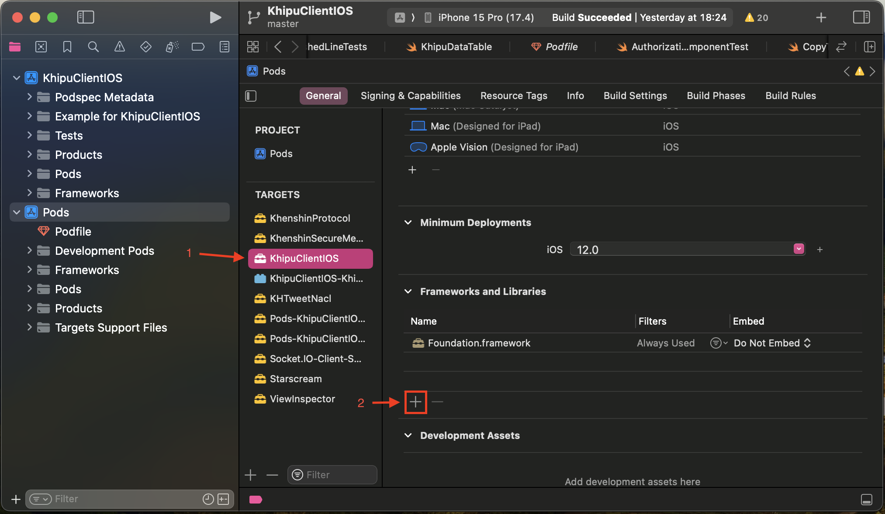
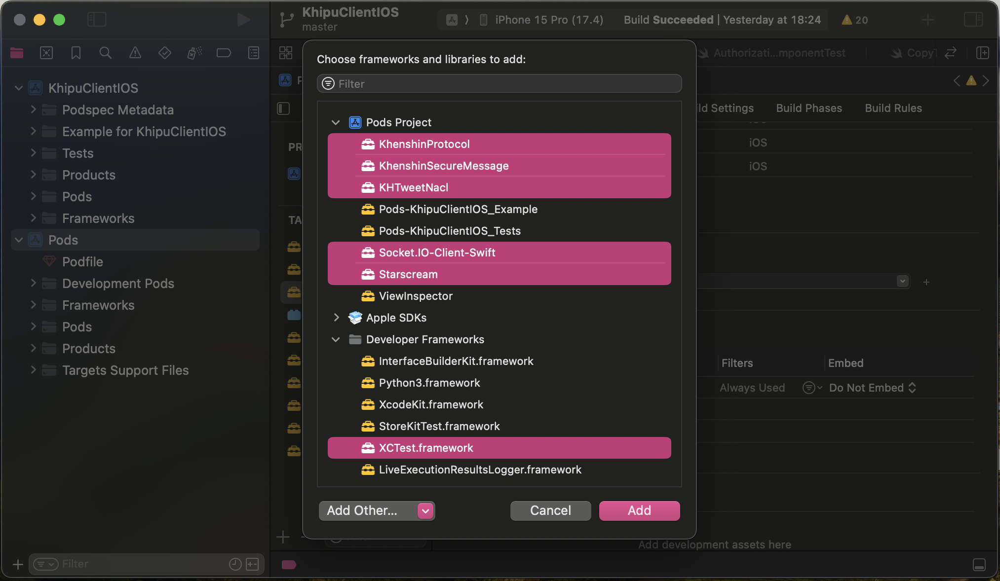
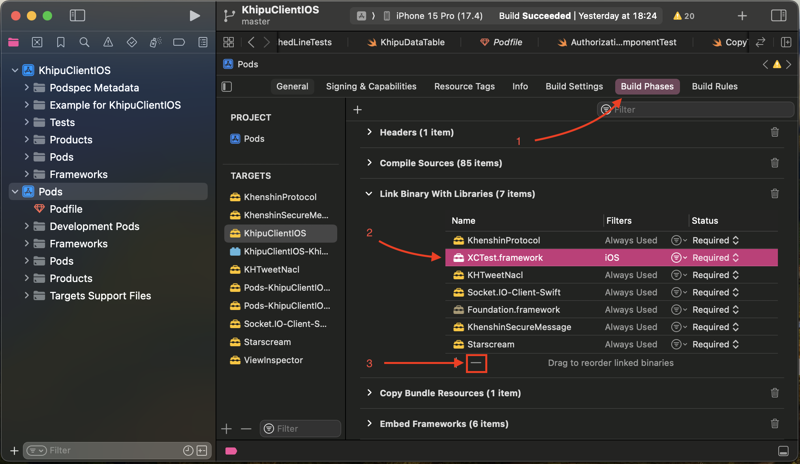

# Example project

This is an example project to learn how to use KhipuClient

## Table of Contents

- [Installation](#installation)
- [Usage](#usage)

## Installation

1. Clone the repository.
2. Install the dependencies using `pod install`.

## Usage

1. Open with XCode and Run

## Previews

To be able to see the project previews we need to add Frameworks and Libraries to our project.

1. Go to Pods, General tab and select **KhipuClientIOS** on the targets. On **Frameworks and Libraries** click on the plus sign. 

2. Select the following frameworks:

    - KhenshinProtocol
    - KhenshinSecureMessage
    - KHTweetNacl
    - Socket.IO-Client-Swift
    - Starscream

3. Go to **Build Phases**, **Link Binary With Libraries** and delete *XCTest.framework*

4. Clean (Command + Shift+ K) and build the project again (Command + B).

You should be able to see the previews now.

